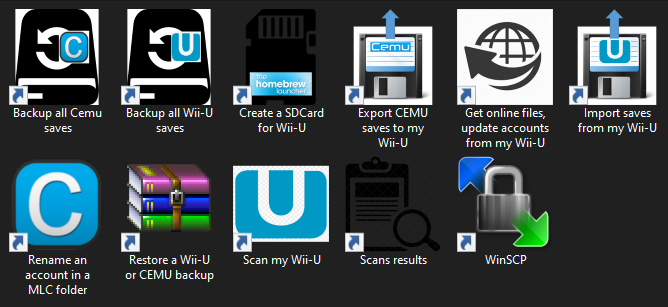

# Cemu2Wii-U

Cemu2Wii-U is an **automated FTP interface** between the WiiU and CEMU (precisely a mlc01 folder : MLC_FOLDER). It allows you to **automatically** :
- dump/update all files needed to play online with CEMU (for all acounts : Mii head, Friends list, certificates and account.dat)
- synchronize saves between CEMU and the Wii-U

And more, see the shortcuts created when installed :

  

Version of CEMU supported >= 1.15.19 (supporting Wii-U accounts handling unless you force to use the 80000001 account)

#
**NOTE for FTP-Everywhere users who already experienced issues with saves injection :**
The FTP server has an issue : it can't handle files timestamps (dates).
I've tried using WinSCP and FileZilla, same date = 01/01/1970

Injecting "simple" saves (such as "Fast Racing Neo" one) will work but for some games (BOTW, WWHD, MK8...) saves will be invalidated by the Wii-U because of incoherents timestamps (dates) on files. Leading in starting a new save or hanging on the splash screen (MK8).

The workaround consists in forcing the timestamp to 0 (=01/01/200) : files are injected with this date (0) and so as they are not anteriors to the timestamp value (0) and will not be rejected.

#
## Main features

- **dump wii-u onlines files needed for CEMU** (for all acounts : Mii head, Friends list, certificates and account.dat). You'll only **have to dump opt.bin and seeprom.bin** using NANDDUMPER **manually** and put them close to CEMU.exe to play online.

- **format (even large) SD card** for the Wii-U containing HBL and essentials apps

- **en/disable remotely the firmware auto-update** feature on the Wii-U

- **change a CEMU's account** (8000000X) used (remane folders in a MLC_PATH)

- **create Wii-U and Cemu backups of your saves**

- **restore backups of saves** (on CEMU and Wii-U)

- **import Wii-U saves** to a MLC folder

- **export CEMU saves** to Wii-U

Import/Exporting/restoring saves concern only your **selection of the games installed on both sides** (CEMU and Wii-U).

You can choose to treat all games that exist in both side as well.

Then, you can choose to **select wich account** will be concerned for each game **or treat all accounts**.

Note that when exporting CEMU saves to the Wii-U, only existing accounts on Wii-U side are treated unless user demands it.
(So you can still force to install a saves created under CEMU on the Wii-U. The meta/saveinfo.xml file is updated when exporting CEMU saves)

#

Scripts are adapted from [BatchFw](https://github.com/Laf111/CEMU-Batch-Framework) with more restrictions. 

Cemu2Wii-U does not have access to the settings.xml file of CEMU install since the input mlc folder could be an "external" one (not included in a CEMU install's folder and eventually shared by multiple CEMU's versions)

So you'll have to **define manually** (if it's not already done) **Wii-U accounts** (and user's name) in CEMU configuration (General Settings / Accounts tab)**.

Every import or export process :
- checks are done for accounts on both sides to : 
  - see if an account need to be created in CEMU UI (import Wii-U account)
  - verify that the account exist on the Wii-U

- backups of saves are done under ./WiiuFiles/Backups/\%DATE\%\_[CEMU|WiiU]\_saves and can be restored (to Wii-U or CEMU).

All scripts verify if CEMU or other Cemu2Wii-U scripts is not already running.

#
## Install (optional):

Launch setup.bat to create shortcuts on your desktop (or any location).

#
## Scripts available to user :

- **createWiiuSDcard.bat** : format (using Fat32Format.exe) an prepare a SD card for the Wii-U containing HBL and essentials apps
- **ftpSetWiiuFirmwareUpdateMode.bat** : en/disable remotely the firmware auto-update feature on the Wii-U
- **getOnlineFiles.bat** : get and save under .\WiiuFiles\OnlineFiles online files needed for CEMU for all users found
  (except opt.bin and seeprom.bin that you need to dump manually from the Wii-U using NANDDUMPER)
- **importWiiuSaves.bat** : get saves from the Wii-U for games that also exist in MLC_FOLDER (backup existing CEMU saves before overwrite files)
- **exportSavesToWiiu.bat** : inject saves to the Wii-U for games that exist in MLC_FOLDER and on the Wii-U filesystem (backup existing Wii-U saves before overwrite files)
- **scanWiiU.bat** : take a snapshot of your Wii-U install (games and location mlc/usb). You need to create a new one on every install/move/delete games operation on your Wii-U
- **backupCemuSaves.bat** : backup only saves in a mlc folder
- **backupWiiuSaves.bat** : backup ALL saves from the Wii-U
- **restoreBackup.bat** : restore CEMU or Wii-U backups
- **changeAccount.bat** : change the account (8000000X) used (remane folders in a MLC_PATH). 

The last script will allow you to : 
- keep only one save for each games by using the same account in CEMU and on the Wii-U (and synchronize CEMU <-> Wii-U game's progression)
- rename existant CEMU's accounts (you'll need to setup the new accounts manually in CEMU UI)
- bypass the CEMU version's limitation above (accounts handling) to play your Wii-U saves on earlier versions of CEMU (change the desired account in 80000001, the only one supported on CEMU < 1.15.19)

But use it only if you know what you are doing...

**Scripts accept optionals arguments in order to be called from command line**.

If you encounter any issue, feel free to pm me on reddit, Discord or GBATemp (to Laf111) and i'll gladly help you.

# 
**IMPORTANT : if you get the files from the repository : use the script ./fixBatFiles.bat (used to produce a release) to force the ANSI encoding and remove trailing spaces in all files (this script also put files in read only) because GitHub will format all files from ANSI to UTF-8 and it might break silentlty some scripts.**
#
