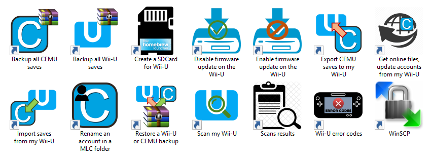

# Cemu2Wii-U

Cemu2Wii-U is an **automated FTP interface** between the WiiU and CEMU (precisely a mlc01 folder : MLC_FOLDER). 

It allows you to **automatically** :
- **dump/update all files needed to play online with CEMU (for all accounts : Mii head, Friends list, certificates and account.dat)**
- **synchronize saves between CEMU and the Wii-U**

And bring other features to communicate with the Wii-U, see shortcuts created once installed :

  

Version of CEMU supported >= **1.15.19** (supporting Wii-U accounts handling unless you force to use the 80000001 account)

Scripts are adapted from [BatchFw](https://github.com/Laf111/CEMU-Batch-Framework) with more restrictions. 

To play online with CEMU : 
- you'll only have to **dump opt.bin and seeprom.bin** using NANDDUMPER **manually** and put them close to CEMU.exe to play online.
- enable the online mode in CEMU account's settings

Import/Exporting/restoring saves process concern only your **selection** of **games installed on both sides** (CEMU and Wii-U). You can choose to treat **all games** that exist in both side as well.

Then, you can choose to **select wich account** will be concerned for each game or **treat all accounts**.

Note that when exporting CEMU saves to the Wii-U, only existing accounts on Wii-U side.

**Every import or export process** :
- **backups of saves are done automatically** under ./WiiuFiles/Backups/\%DATE\%\_[CEMU|WiiU]\_saves and **can be restored (to Wii-U or CEMU)**.

- checks are done for accounts on both sides to : 
  - see if the account need to be added in CEMU UI (import Wii-U account)
  - verify that the account exist on the Wii-U

All scripts verify if CEMU or other Cemu2Wii-U scripts is not already running.

#
**NOTE for FTP-Everywhere users who already experienced issues with saves injection :**
The FTP server has an issue : it can't handle files timestamps (dates).
I've tried using WinSCP and FileZilla, same date = 01/01/1970

Injecting "simple" saves (such as "Fast Racing Neo" one) will work but for some games (BOTW, WWHD, MK8...) saves will be invalidated by the Wii-U because of incoherents timestamps (dates) on files. Leading in starting a new save or hanging on the splash screen (MK8).

The workaround consists in forcing the timestamp to 0 (in the meta/saveinfo.xml) : files are injected with this date (0) and so as they are not anteriors to the timestamp value (0), will not be rejected.

#
## Install (optional):

Launch setup.bat to create shortcuts on your desktop (or any location).

#
## Scripts available to user :

- **createWiiuSDcard.bat** : format (using Fat32Format.exe) an prepare a SD card for the Wii-U containing HBL and essentials apps
- **ftpSetWiiuFirmwareUpdateMode.bat** : en/disable remotely the firmware auto-update feature on the Wii-U
- **getOnlineFiles.bat** : get and install in a mlc folder, online files needed for CEMU for all accounts found
  (except opt.bin and seeprom.bin that you need to dump manually from the Wii-U using NANDDUMPER)
- **importWiiuSaves.bat** : get saves from the Wii-U for games that also exist in MLC_FOLDER (backup existing CEMU saves before overwrite files)
- **exportSavesToWiiu.bat** : inject saves to the Wii-U for games that exist in MLC_FOLDER and on the Wii-U filesystem (backup existing Wii-U saves before overwrite files)
- **scanWiiU.bat** : take a snapshot of your Wii-U install (games and location mlc/usb). You need to create a new one on every install/move/delete games operation on your Wii-U
- **backupCemuSaves.bat** : backup only saves in a mlc folder
- **backupWiiuSaves.bat** : backup ALL saves from the Wii-U
- **restoreBackup.bat** : restore CEMU or Wii-U backups
- **changeAccount.bat** : change the account (8000000X) used (remane folders in a MLC_PATH). 

The last script will allow you to : 
- keep only one save for each games by using the same account in CEMU and on the Wii-U (and synchronize CEMU <-> Wii-U game's progression)
- rename an existant CEMU's account (PersitentId in account.dat is replaced as well)
- bypass the CEMU version's limitation above (accounts handling) to play your Wii-U saves on earlier versions of CEMU (change the desired account in 80000001, the only one supported on CEMU < 1.15.19)

But use it only if you know what you are doing...

**Scripts accept optionals arguments in order to be called from command line. Feel free to use or integrate in your scripts/API**.

If you encounter any issue, feel free to pm me on reddit, Discord or GBATemp (to Laf111) and i'll gladly help you.

# 
**IMPORTANT : if you get the files from the repository : use the script ./fixBatFiles.bat (used to produce a release) to force the ANSI encoding and remove trailing spaces in all files (this script also put files in read only) because GitHub will format all files from ANSI to UTF-8 and it might break silentlty some scripts.**
#
